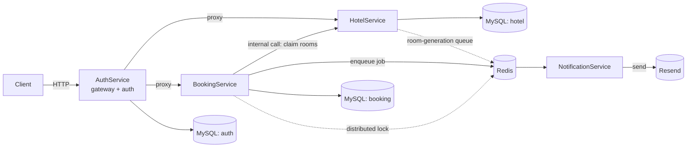

# Hotel Booking Microservices

A hotel booking backend split into four services (auth, hotels, bookings, notifications), each with its own database. It covers the whole flow end to end: sign up, browse hotels, book a room, get a confirmation email. The booking part is built to survive concurrent requests — no two people can grab the same room for the same night.

## Architecture



AuthService is the only thing a client ever talks to directly. It handles signup/login/JWT issuance and proxies everything else to the right service. HotelService and BookingService don't just trust whatever the gateway forwards them, though — each one verifies the JWT itself, so if either service were ever reachable directly, it would still reject unauthenticated requests on its own.

## Services

| Service             | Responsible for                                                                        |
| ------------------- | -------------------------------------------------------------------------------------- |
| AuthService         | signup/login, JWT issuance, RBAC, API gateway                                          |
| HotelService        | hotels, room categories, room inventory, async room generation, availability scheduler |
| BookingService      | booking creation/confirmation, idempotency, distributed locking                        |
| NotificationService | email queue worker, Resend integration                                                 |

Each service has its own README with the full endpoint list and setup details.

## Features

- Distributed locking on bookings (Redlock) — no double-booked rooms
- Idempotent booking confirmation — retries can't double-process the same booking
- Room inventory generated and auto-extended in the background (BullMQ + cron)
- JWT verified independently by every service, not just the gateway
- Role-based access control enforced per route
- Separate internal API key for service-to-service calls
- Async email delivery through a job queue (BullMQ + Resend)
- Correlation IDs tracked across services for request tracing

## Stack

Node.js, TypeScript, Express 5, Prisma + MySQL (one database per service), Redis (BullMQ + Redlock), BullMQ, node-cron, Resend, JWT.

## Running it locally

Docker for MySQL/Redis, Node for everything else.

```bash
docker compose up -d
```

Then, for each service (`AuthService`, `HotelService`, `BookingService`, `NotificationService`):

```bash
cd <ServiceName>
cp .env.example .env   # fill in real values — some secrets have to match across services, see the comments
npm install
npx prisma migrate dev
npm run dev
```
